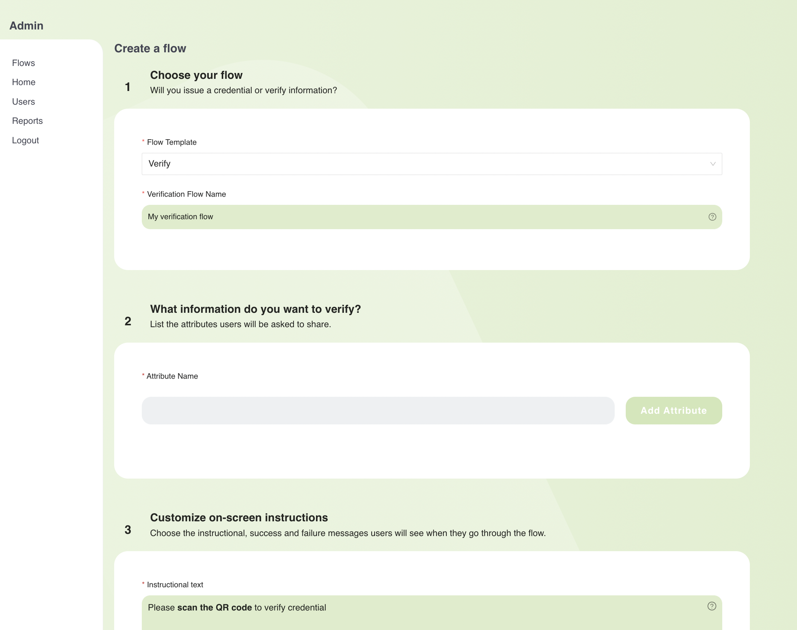
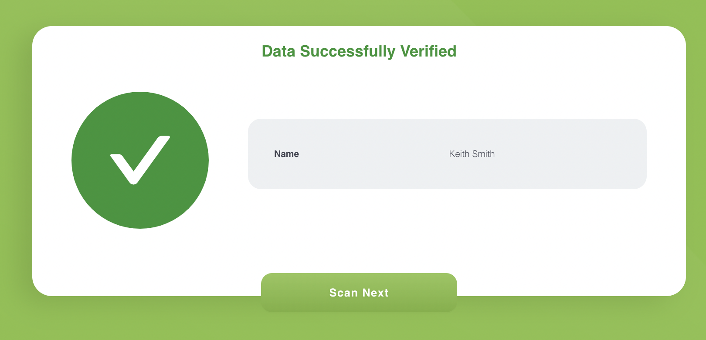

# Digital Trust Ideation

#### Table of Contents
- [Digital Trust Ideation](#digital-trust-ideation) 
      - [Table of Contents](#table-of-contents)
  - [Tutorial](#tutorial)
  - [Prototype Documentation](#prototype-documentation)
  

Follow these instructions to develop a prototype using **Verity Flow** by [Avast](https://avast.com) for the ```Digital Trust Ideation``` track of the hackathon.

Verity Flow will act as an issuer and as a verifier, and the Connect.Me mobile application will be the holder.
## Tutorial
The following is a tutorial to lead you step-by-step through the issuance and verification flows using these tools.

1. First, install the Connect.Me Digital Wallet mobile application on your iphone or android device.  It is available for free from the Apple AppStore for your iphone device, or from Google Play for your android device.

2. Create one or more Verity Flow accounts by sending an email of the following form to [Natalia Moskaleva](mailto:natalia.moskaleva@avast.com):

   ```
   Subject: DFS TruCreds Hackathon - Request for Verity Flow account(s)

   Team: <your team name>
   Discover email addresses: <one or more space-separated Discover team member addresses>
   ```

   A separate Verity Flow account will be created for each email address listed.
   An email will be sent to each address with login information.
   Wait until you receive this login information.

3. Login to Verity Flow [here](https://verity-flow.pps.evernym.com) from your DFS or personal laptop.

   When you initially login, you will be asked to set up multi-factor authentication; choose the "Remind Me Later" option.

4. Create an issuer flow as follows:

   Select "Flows" on the left-hand panel and click "Create New Flow".  You should see a screen similar to the following.

   

   For #1, select "Issue" for the "Flow Template", and for the "Credential Name", enter a name which reflects the type of credential being issue (e.g. "My DFS Employee Credential").

   For #2, enter one or more attribute names and types for each attribute.

   For #3, you may customize any of the prompts that you will see each time the flow is executed; however, you need not change any of the default values.

   For #4, you may customize the logo or colors if you want, or just leave the default values.

   Click "Save Flow".

5. Run an issuer flow to issue a credential as follows:

   Click "Flows" on the left-hand panel and you'll see one line for each flow that you have created so far.  For example, the following is an issuer flow.

   

   Click "Run Flow" for the flow you want to run.  You will see a screen similar to the following.

   

   Enter values for each attribute and click the "Generate QR Code" button.  You will then see a QR code as follows.

   

   Open the Connect.Me mobile app and click the "Scan" button on the lower-right corner of the home screen.  Scan the QR code displayed by the Verity Flow application.  Accept the credential on your mobile device.

   Click on the hamburger on the top-left and select "My Credentials".  Click on the card representing your credential to see the values stored on your device.

6. Display issuer info as follows:

   In order to properly verify that a user has a credential issued by a particular flow, you will need some issue information.  In order to display that information,
   go to [your flows](https://verity-flow.pps.evernym.com/flows)and find the appropriate issuance flow.  Click on the pencil icon on the issuance flow whose information you want.  Then scroll to the bottom of the screen and you'll see information similar to the following:

   

   For this tutorial, we will use the `Credential Definition ID`, so copy and save that value.

7. Create a verification flow as follows:

   Go back to [Verity Flow](https://verity-flow.pps.evernym.com/flows), click on "Flows" on the left-hand panel, and click the "Create New Flow" button again.

   For #1, select "Verify" for the "Flow Template", and for the "Verification Flow Name", enter a name which reflects the type of verification being performed (e.g. "DFS Employee Verification").

   For #2, add an `Attribute name` for each attribute you want to verify.  You may require multiple attributes from the same credential or from different credentials, known as a composite proof.  The attribute name must exactly match the name of an attribute issued.  For example, the following screen demonstrates asking for a single attribute called "name" which must come from a credential identified by the credential definition ID previously copied.

   

   For #3, you may customize any of the prompts that you will see each time the flow is executed; however, you need not change any of the default values.

   For #4, you may customize the logo or colors if you want, or just leave the default values.

   Click "Save Flow".

8. Run a verification flow to perform a verification as follows:

   Click "Flows" on the left-hand panel and you'll see one line for each flow that you have created so far.  Click "Run Flow" for the verification flow that you want to run.  You will see a screen with a QR code as follows:

   
   
   Open the Connect.Me mobile app and click the "Scan" button on the lower-right corner of the home screen.  Scan the QR code displayed by the Verity Flow application.  You should see a "Proof Request" screen on your mobile device with the names and values of the attributes that you are being asked to share.  Click the "Share Attributes" button.

   You should then see a screen similar to the following on your Verity Flow application.

   

Congratulations!  You have successfully performed both an issuance and a verification flow.

## Prototype Documentation
Some use cases are not as trivial as the [above tutorial](#tutorial). For example, some may require more than one Issuer and/or Verifier. Others may even require multiple credential schemas per Issuer. 

While it is *not required* for the submission criteria for the ```Digital Trust Ideation``` track, it is **highly recommended** that the team documents the prototype recreation steps.

Follow these instructions to create a reproducible prototype creation file:

1. Open the repository using your favorite IDE (i.e. [Visual Studio Code][1], [Atom][12]).
2. Edit the file called `make_prototype.md` in the repo using your IDE. 
3. Using the [above tutorial](#tutorial) as a guide, copy the applicable steps to the `make_prototype.md` file.
4. Customize (update) each step as applicable for the use case.
5. Repeat steps 3-4 as required. 

[1]: https://code.visualstudio.com/
[2]: https://atom.io